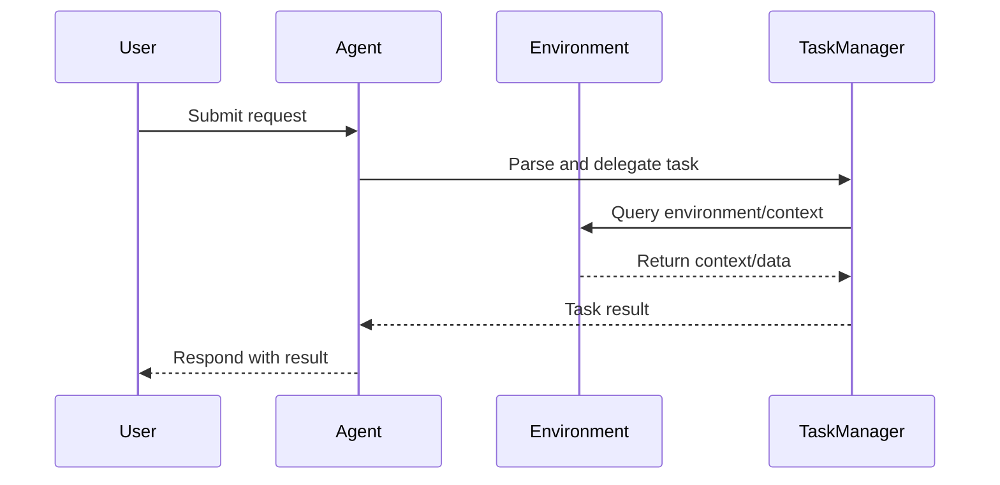

# Agentic Flow Communication

This project demonstrates an agentic flow communication system. Below is a sequence flow diagram illustrating the communication between the main components.

## Sequence Flow Diagram

## Description
- **User**: Initiates a request or query.
- **Agent**: Receives the request, interprets it, and coordinates the flow.
- **TaskManager**: Handles task delegation, context management, and communication with the environment.
- **Environment**: Provides necessary data or context for task execution.

This diagram helps visualize the step-by-step communication and data flow in an agentic system.
