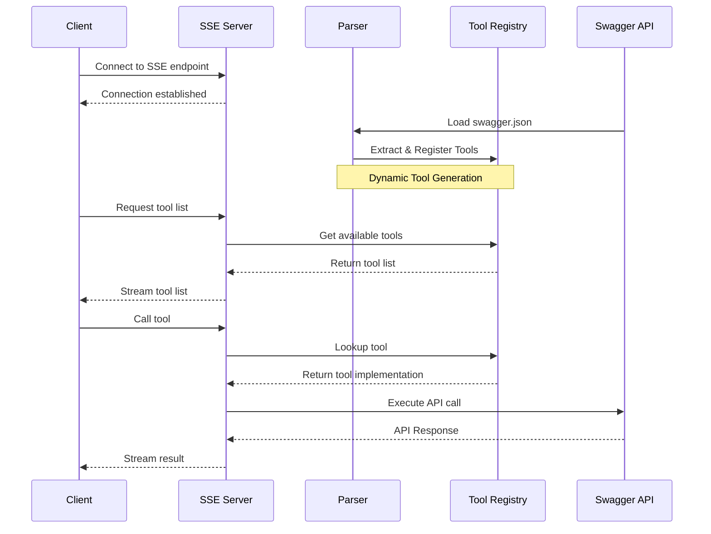

# AgenticAI

This repository showcases an experimental Model Context Protocol (MCP) server implementation that dynamically generates MCP tools from Swagger/OpenAPI specifications. This is a groundbreaking approach to achieving dynamic tool implementation in MCP, where traditionally tools were statically defined.

## Features
- Dynamic MCP tool generation from swagger.json input
- First experimental implementation of dynamic tool creation in MCP
- Server-Sent Events (SSE) integration for real-time updates
- Example scripts demonstrating dynamic tool usage
- Jupyter notebook for testing and experimentation

## Sequence Flow Diagram

## Usage
- Run a Sample FastAPI server: `python sample-fastapi-server.py`
- Run the MCP server: `python sse-server.py`
- Experiment with code in `Notebook.ipynb`
- Explore other scripts for additional features

## Requirements
- Python 3.8+
- (Optional) Install dependencies: `pip install -r requirements.txt`

---

For more details, see the code and comments in each file.
